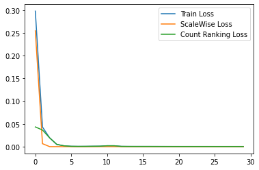
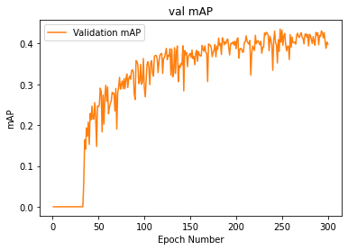

# Self-Supervised Nuclei Segmentation in Microscopy Images

B.Sc. thesis project, Sharif University of Technology (2020). Supervisor: Dr. Mohammad Hossein Rohban.

Labelling cell nuclei in histopathology images takes expert time, so annotated data is scarce. This project tests whether **self-supervised pretraining** on unlabeled images can help a **U-Net** segment nuclei when only a small labeled set is available.

## Method

1. **Self-supervised pretraining (no labels).** From each unlabeled image the data loader builds a triplet: an **anchor** (random 384×384 crop), a **positive** (the same region shifted by up to 50 px) and a **negative** (a 64–256 px sub-crop of the positive, upscaled to 384×384, so it shows nuclei at a different scale). The U-Net encoder is trained with two losses:
   - **Scale-wise triplet loss:** a shared-weight encoder pulls the anchor and positive embeddings together and pushes the rescaled negative away.
   - **Counting-ranking loss:** a small head scores each embedding, with a margin loss that ranks the full-scale crop against the zoomed-in sub-crop, encouraging scale-aware features related to how many nuclei a patch contains.
2. **Fine-tuning.** The pretrained encoder is plugged into a full U-Net and fine-tuned for nuclei segmentation using **10% of the labeled training data**.
3. **Baseline.** The same U-Net is trained on the same 10% from scratch, without pretraining.
4. **Encoder experiments.** A U-Net encoder, a custom CNN embedding network and an ImageNet-pretrained **ResNet-101** were compared as the self-supervised backbone.

**Metrics:** Dice coefficient and Kaggle-style mean average precision (mAP averaged over IoU thresholds 0.5–0.95).

## Data

- [MoNuSeg 2018](https://monuseg.grand-challenge.org/) (Multi-Organ Nucleus Segmentation)
- [Kaggle Data Science Bowl 2018](https://www.kaggle.com/c/data-science-bowl-2018) (stage 1)

The datasets are not included. The notebooks were run on Google Colab and read zipped data from Google Drive. To run them, download the datasets and update the paths in the data-loading cells.

## Results

From the thesis (Table 5.1). All models are trained on 10% of the labeled Kaggle DSB 2018 Stage 1 training data and tested on the Stage 1 test set. "Self-supervised (n)" means n epochs of self-supervised pretraining of the encoder before training the full U-Net.

| Model | Val mAP (300 ep.) | Test mAP (300 ep.) | Val mAP (500 ep.) | Test mAP (500 ep.) |
|---|---|---|---|---|
| U-Net from scratch | 0.467 | 0.261 | 0.492 | 0.261 |
| Self-supervised (10) | 0.445 | 0.266 | 0.480 | 0.255 |
| Self-supervised (30) | 0.440 | 0.270 | **0.505** | **0.274** |

With 30 epochs of self-supervised pretraining and 500 epochs of U-Net training, the model reached the best results: **mAP 0.505 on validation and 0.274 on test**, slightly above the from-scratch baseline. The gap is small; the pretext losses converge within a few epochs (below), which suggests the self-supervised stage overfits. The thesis proposes softer ranking losses (e.g. softmax instead of max) and adversarial perturbations as next steps.

<p float="left">
  
  
</p>

## Repository structure

```
notebooks/
  01_ssl_pretraining_and_finetuning.ipynb    # main pipeline: pretraining, fine-tuning, baseline
  02_encoder_architecture_experiments.ipynb  # U-Net vs custom CNN vs ResNet-101 encoders
docs/
  BSc_thesis_Bahar_Jahani_en.pdf             # full thesis (English translation)
  BSc_thesis_Bahar_Jahani_fa.pdf             # full thesis (original, Persian)
images/                                      # figures used in this README
requirements.txt
```

## Tech

Python, PyTorch, torchvision, OpenCV, scikit-image, NumPy, Matplotlib, Google Colab (GPU).

## Author

Bahar Jahani · [LinkedIn](https://www.linkedin.com/in/bahar-jahani-a711a81b3)
